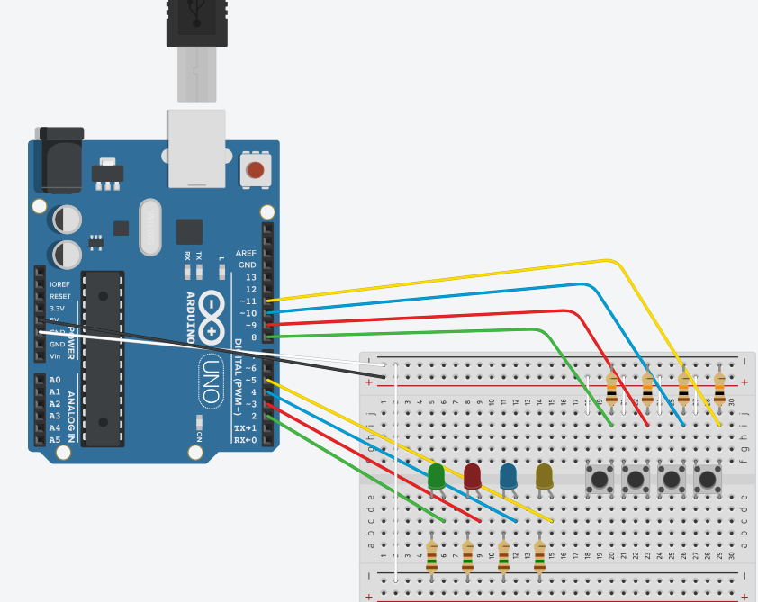

# SSC0180

Relatório dos Trabalhos de Eletrônica para Computação dos alunos Arthur Domingues Rios (13731751) e Renan Sawaya Sacamoto Calusa (13672280).

*As imagens dos projetos e o código utilizado no arduíno estão em suas respectivas pastas.*


# Fonte de Tensão Regulável (3V a 12V):


### Lista de componentes:
* Ponte de Diodo - R$3,90
* Transformador de razão ≈ 7.05 espiras (25V)
* Capacitor 470uF - R$1,50
* Led Verde - R$0,50
* Diodo Zenner 13V - R$0,50
* Transistor / 0,80
* Resistor 3.3k ohms (x2) - R$0,14
* Resistor 120 ohms (x3) - R$0,21 
* Resistor 2.2k ohms - R$0,07
* Potenciômetro 5k ohms - R$7,00
* Protoboard - R$39,10
* Jumpers 

Total: R$53,72

### Resumo:
1. Transformador: O transformador foi usado para transformar a voltagem de 127V para aproximadamente 25V.

2. Ponte de diodo: A ponte formada por 4 diodos tem a finalidade de aproveitar os dois ciclos da fonte, tanto a positiva quanto a negativa (cada diodo gasta 0.7 volts, portanto o gasto da ponte é 1.4 volts).

3. Capacitor: Possui a função de armazenar e liberar carga durante os ciclos positivos e negativos da fonte, fazendo com que mantenha-se uma carga "constante" (filtro de fonte).

4. Diodo Zenner: Regula a tensão para deixar passar apenas quando tiver 13V.

5. Transistor: Tem a finalidade de regular a corrente que passa.

6. Resistores: Foram utilizados para finalidades diferentes, como não queimar transistores e diodos, além de ajustar correntes e tensões em determinados pontos.

7. Potenciômetro: É uma resistência variável, então sua finalidade é ajustar a tensão na saída da fonte.


### Projeto:


* Link Falstad: https://tinyurl.com/2yx6b8p5


### Funcionamento:


[](https://youtube.com/shorts/vt2bg8lfmSU?si=ytmtWbXtoHivT-LI)


### Explicação:


# Genius:


### Lista de Componentes:
* Arduino UNO - R$108,00
* Led Vermeho - R$0,50
* Led Amarelo - R$0,50
* Led Azul - R$0,50
* Led Verde - R$0,50
* Resistor de 150 ohms (x4) - R$0,28
* Resistor de 10k ohms (x4) - R$0,28
* Protoboard - R$39,10
* Jumpers


Total: R$149,66


### Resumo:


1. Resistores de 10k ohms: São os chamados Pull Down, que servem para manter o nível da porta em “LOW” enquanto o botão na for pressionado.

2. Resistores de 150 ohms: Utilizando a fórmula:

                            R = (V cc - V led)/i led

* pode-se calcular a resistência necessária para colocar junto do led visando impedir a queima dele. No caso, a tensão utilizada foi de 5V, a do led de 2V e sua corrente de 20 mA, resultando na resistência de 150 ohms.

3. Leds coloridos: Servem para indicar a ordem em que o jogador deve apertar os botões.


### Projeto:





### Funcionamento: 


[](https://youtube.com/shorts/dpLQA53glyI?si=336aOreR8srbzrT]I)


* Como mostrado no vídeo, a ideia do jogo é apertar os botões na ordem em que os leds piscam, com o máximo de 20 rodadas (no vídeo foram apenas 3 apenas para mostrar como funciona a animação de vitória).


### Explicação:


```C
bool game_over = false;
int* sequence;
int MAXROUND = 3;
int rodada = 1;
int leds[] = {2, 3, 4, 5}; // Saidas digitais dos Leds
int buttons[] = {8, 9, 10, 11}; // Saidas digitais dos botoes
```

* o vetor de `leds` e `buttons` servem para indicar qual "porta" o arduino irá usar para enviar um sinal de `OUTPUT` e `INPUT` respectivamente, assim pode-se utilizar um indice de 0 a 3 para representar todos os leds e botões.


```C
sequence = (int*) malloc(sizeof(int)*MAXROUND);
randomSeed(analogRead(0));
for (int i=0; i<MAXROUND; i++) sequence[i] = random(4);
```

* `sequence` representa a sequência aleatória que irá ser utilizada durante o jogo, a fim de eficiência, realiza-se o preenchimento desse array no início do jogo, e não a cada passo realizado (por mais que gaste mais memória, na nossa opinião é uma troca justa por tempo e complexidade desnecessária).


```C
void loop() {

  // Verificar se o jogo acabou por numero de round
  if (rodada == MAXROUND + 1) {
  
    // Animacaçao de vitoria
    
    for (int j=0; j<3; j++) {
      for (int i=0; i<4; i++) {
    
        digitalWrite(leds[i], HIGH);
        delay(100);
        digitalWrite(leds[i], LOW);
        delay(100);
      }
    }
  
    reset_game();
  }
  
  // Verificar fim de jogo por resposta incorreta
  else if (game_over) {
  
    reset_game();
  }

// Mostra a sequencia do proximo round
showSequence();

// Espera o input do jogador e verifica a resposta para a sequencia inteira
waitPlayer();

rodada++;
}
```


* A função `loop` cuida da funcionalidade de verificação de final de jogo tanto pela pontuação (se o jogador acertou a sequência até o último round previsto por `MAXROUND`) ou por resposta incorreta (pela variável `game_over`). Além disso, a animação de vitória faz os leds piscarem 3 vezes em uma forma de "onda", já a de derrota é realizada em outra função para fins mais práticos.


```C
void showSequence() {

  // Mostrar a sequencia da rodada atual, ligando os leds
  for (int i=0; i<rodada; i++) {
  
    digitalWrite(leds[sequence[i]], HIGH); // Liga o led atual
    delay(500);
    digitalWrite(leds[sequence[i]], LOW); // Desliga o led atual
    delay(500);
  }
}
```


* A função `showSequence` é simples, pega o round atual pela variável `rodada` e mostra a próxima sequência que o jogador deverá acertar.


```C
void waitPlayer() {

  for (int i=0; i<rodada; i++) {
  
    bool notPlay = true;
    int answer;
  
    while (notPlay) {

      // Verificar qual botao foi pressionado
      for (int k=0; k<4; k++) {
      
        if ((digitalRead(buttons[k]) == HIGH)) {
          
          // k guarda qual botao foi pressionado
          digitalWrite(leds[k], HIGH);
          delay(200);
          digitalWrite(leds[k], LOW);
          delay(600);
          
          notPlay = false;
          answer = k;
          break;
        }
      }
    }
    
    // Verificar se errou
    checkPlay(answer, i);
  }
}
```


* A função `waitPlayer` pega o input do jogador e chama a função  `checkPlay` para conferir cada botão pressionado um por vez - uma vez que, caso esteja errado, queremos que o jogo acabe na hora. Para isso, entra em um loop infinito utilizando `while()`, e verifica se algum botao foi pressionado (i.e. caso a leitura do `INPUT` seja `HIGH`). No caso em que o programa identificou um botão pressionado, o led referente à esse botão é ligado e verifica-se se bate com a resposta.


```C
void checkPlay(int guess, int rodada) {

  if (sequence[rodada] != guess) {
    
    // Caso que errou - pisca todos os leds 5 vezes
    for (int i=0; i<5; i++) {
    
      for (int k=0; k<4; k++) digitalWrite(leds[k], HIGH);
      delay(100);
      for (int k=0; k<4; k++) digitalWrite(leds[k], LOW);
      delay(100);
    }
    
    // Terminar o jogo por escolha errada
    game_over = true;
    rodada--;
  }
  
  // Caso acerte, apenas vai para o proximo round
}
```


* A função `checkPlay` pega o botão pressionado e a rodada atual (e rodada nesse contexto significa em qual parte da sequência o botão se refere), e verifica com o array `sequence` se a resposta bate; caso não bata, a animaçao de derrota é piscar 5 vezes todos os leds ao mesmo tempo. Além disso, seta o `game_over` e `rodada--` - pois há o caso de ser a última rodada, e quando voltar à função `loop`, pelo modo que foi montado, a animação de vitória por round aparecia primeiro.


```C
void reset_game() {

  randomSeed(analogRead(0));
  for (int i=0; i<MAXROUND; i++) sequence[i] = random(4);
  rodada = 1;
  game_over = false;
  delay(2000);
}
```


* A função `reset_game` é utilizada para reiniciar o jogo, do jeito que foi implementada, apenas gera novos números aleatórios para a sequência e coloca valores default para as variáveis. Note que caso haja vitória ou derrota, o jogo é reiniciado automaticamente após 2 segundos.


* Obs: o código foi baseado no código de Professor José de Assis (utilizamos a lógica do Arduino para os INPUTS e OUTPUTS, porém a parte da lógica - por mais que parecida - foi escrita por nós para um código mais legível e eficiente).
